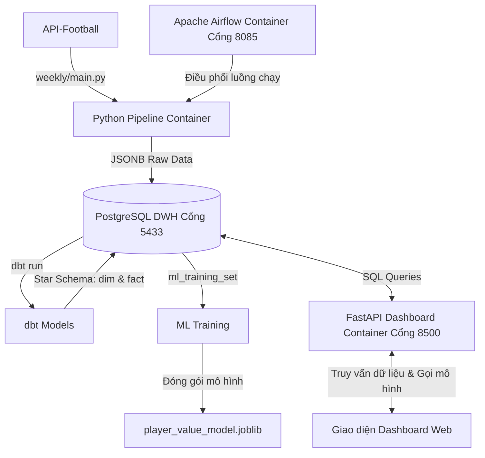

# ⚽ Vua Bóng Đá AI (King of Football AI)
### Modern Data Stack ELT Pipeline & Multi-Model AI Player Valuation

Dự án **Vua Bóng Đá AI** là một hệ thống kỹ thuật dữ liệu toàn diện (End-to-End Data Engineering & Data Science), tự động thu thập dữ liệu từ nhà cung cấp API bóng đá, làm sạch và chuẩn hóa qua kiến trúc kho dữ liệu (DWH Star Schema) bằng dbt, tự động hóa quy trình bằng Apache Airflow, huấn luyện 4 mô hình học máy (Gradient Boosting) chuyên biệt theo vị trí để dự toán giá trị chuyển nhượng và hiển thị lên giao diện Web Dashboard cao cấp.

---

## 🏗️ Kiến trúc Hệ thống (Architecture)



---

## ⚡ Các Tính năng Nổi bật

1. **Đường ống ELT tự động hóa hoàn toàn (Extract - Load - Transform):**
   * Cào dữ liệu lịch sử bóng đá (mùa giải từ 2010 đến 2026), các trận đấu tuần, thông tin cầu thủ và lịch sử chuyển nhượng thô từ API dưới dạng JSONB.
   * Chuyển đổi (Transform) thô sang mô hình dữ liệu sạch (Star Schema) phân tách rõ rệt các bảng chiều (**Dimension**: `dim_players`, `dim_teams`, `dim_leagues`) và bảng sự kiện (**Fact**: `fact_player_statistics`, `fact_player_transfers`).
2. **Kiểm tra chất lượng dữ liệu tự động (`dbt test`):**
   * Xác thực tính duy nhất (Unique), không rỗng (Not Null) và tính toàn vẹn khóa ngoại (Relationships) của cơ sở dữ liệu.
3. **Mô hình Trí tuệ Nhân tạo đa vị trí (Multi-Model AI Estimator):**
   * Huấn luyện **4 mô hình Gradient Boosting chuyên biệt** theo từng vai trò cầu thủ: **Attacker**, **Midfielder**, **Defender**, và **Goalkeeper**.
   * Đạt mức cải thiện độ chính xác R2 vượt trội (R2 tăng lên **`0.40`** đối với Hậu vệ và **`0.21`** đối với Thủ môn).
   * Cơ chế tự học nhận dạng đặc trưng vị trí (ví dụ: Hậu vệ được định giá dựa trên tỷ lệ chuyền bóng `passes_per_90` thay vì số bàn thắng).
   * Tự động nhân hệ số tăng trưởng World Cup (World Cup Boost) nếu cầu thủ tỏa sáng tại giải thế giới.
4. **Điều phối tuần tự tự động (Workflow Orchestration):**
   * Apache Airflow tự động chạy DAG vào **10:00 sáng Thứ Hai hàng tuần** (Giờ VN): Cào trận mới ➜ Chạy dbt ➜ Huấn luyện lại AI.
   * Tích hợp cơ chế **chạy bù (Catchup)** thông minh và an toàn, tự kích hoạt chạy bù ngay khi bật máy tính nếu bỏ lỡ lịch hẹn.
5. **Giao diện Dashboard trực quan và hiện đại:**
   * Thiết kế phong cách **Glassmorphism (Kính mờ) Dark Mode** sang trọng.
   * Tra cứu cầu thủ theo tên thời gian thực, xem thẻ chỉ số chi tiết từng mùa giải và kết quả định giá AI Market Value phát sáng.

---

## 🛠️ Công nghệ Sử dụng (Tech Stack)

* **Ngôn ngữ chính:** Python 3.10, SQL (PostgreSQL, Jinja SQL).
* **Cơ sở dữ liệu:** PostgreSQL 15 + pgAdmin 4.
* **Biến đổi dữ liệu:** dbt-core v1.7.3 (dbt-postgres).
* **Machine Learning:** scikit-learn v1.7.2, pandas v2.3.3, numpy v2.2.6, joblib.
* **Lập lịch & Tự động hóa:** Apache Airflow v2.7.3 (SequentialExecutor).
* **Backend API:** FastAPI, Uvicorn.
* **Frontend UI:** HTML5, Vanilla CSS3 (Glassmorphism), Vanilla JavaScript (ES6).
* **Hạ tầng:** Docker & Docker Compose.

---

## 🚀 Hướng dẫn Cài đặt & Khởi chạy

### Yêu cầu hệ thống:
* Đã cài đặt **Docker** và **Docker Desktop**.
* Cài đặt **Git**.

### Bước 1: Thiết lập cấu hình môi trường
1. Sao chép file cấu hình:
   ```bash
   cp .env.example .env
   ```
2. Mở file `.env` và điền API Key bóng đá của bạn (đăng ký miễn phí tại `api-sports.io`).

### Bước 2: Khởi động toàn bộ các dịch vụ bằng Docker
Mở Terminal tại thư mục gốc và khởi động Docker Stack:
```bash
docker-compose up -d
```
Docker sẽ tự động tải các image, cấu hình cơ sở dữ liệu Postgres, cài đặt thư viện và khởi động 4 dịch vụ chính.

### Bước 3: Thu thập dữ liệu nền lịch sử (Historical ELT)
Chạy lệnh sau để cào dữ liệu lịch sử các mùa giải và khởi chạy dbt làm sạch ban đầu:
1. Cào dữ liệu lịch sử (mất vài phút):
   ```bash
   docker-compose run --rm pipeline python main.py
   ```
2. Khởi chạy dbt để tổng hợp và liên kết kho dữ liệu:
   ```bash
   docker-compose run --rm dbt run
   ```
3. Huấn luyện mô hình ML đa vị trí lần đầu:
   ```bash
   docker-compose run --rm pipeline python ml_predictor/train.py
   ```

---

## 🔗 Đường dẫn Truy cập Các Dịch vụ (Access Links)

* 📊 **Dashboard tra cứu cầu thủ & Dự đoán AI:** **[http://localhost:8500](http://localhost:8500)**
* 🌬️ **Apache Airflow Web UI (Quản lý luồng tự động):** **[http://localhost:8085](http://localhost:8085)**
  * *Tài khoản:* `admin`
  * *Mật khẩu:* `C7P7EQVmAYN2m5mD`
* 🐘 **pgAdmin 4 (Quản lý Cơ sở dữ liệu Postgres):** **[http://localhost:8080](http://localhost:8080)**
  * *Tài khoản:* `admin@admin.com`
  * *Mật khẩu:* `admin`
  * *Cổng kết nối Postgres máy thật:* `localhost:5433`

---

## 📁 Cấu trúc Thư mục Dự án

```text
Vua_Bong_Da/
├── airflow/                   # Cấu hình Airflow DAGs và logs
│   └── dags/
│       └── football_elt_dag.py
├── dashboard/                 # Mã nguồn FastAPI Backend & Frontend UI
│   ├── static/
│   │   ├── index.html
│   │   ├── style.css
│   │   └── app.js
│   ├── requirements.txt
│   └── app.py
├── db/                        # DDL khởi tạo Postgres
│   └── init.sql
├── dbt_project/               # Dự án dbt (Models, Sources, schema)
│   ├── models/
│   │   ├── staging/
│   │   └── marts/
│   └── dbt_project.yml
├── ml_predictor/              # Kịch bản huấn luyện Machine Learning
│   ├── train.py
│   └── predict.py
├── pipeline/                  # Module cào dữ liệu (Python ingestion)
│   ├── utils/
│   ├── main.py
│   └── weekly.py
├── docker-compose.yml         # File Docker orchestration chính
└── .env                       # File cấu hình môi trường bảo mật
```
